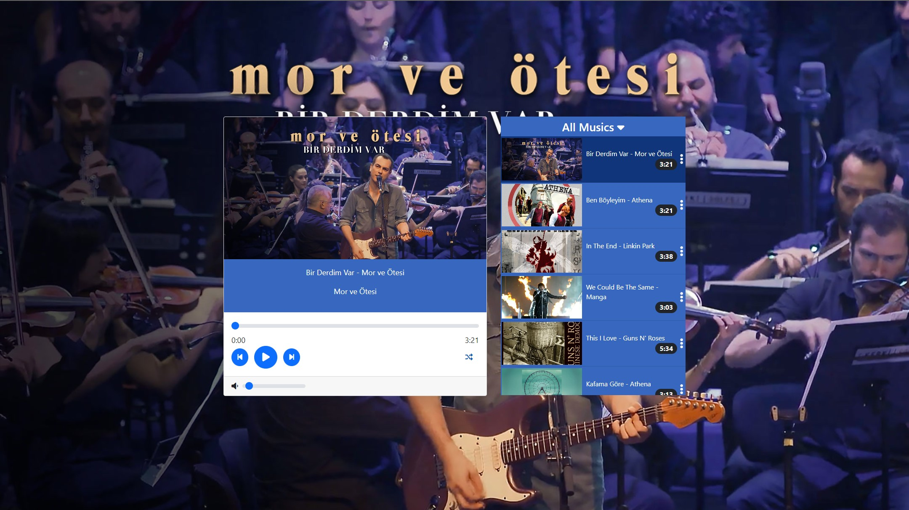
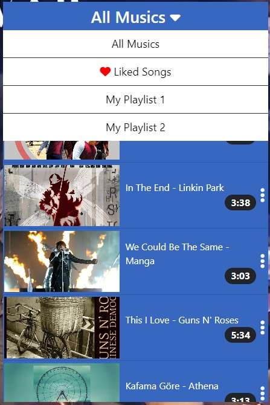
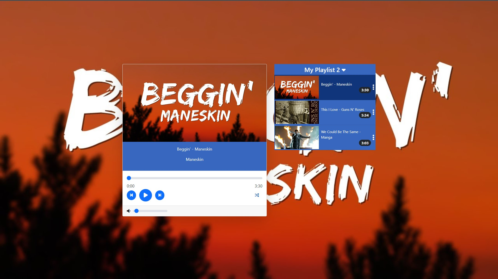
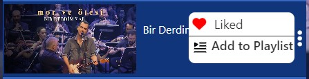
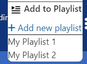

# Music-Player
It is a local music player. I couldn't implement an API to play any song that user want to listen, yet. I am planning to do that in the other versions. For now, this player can:
- play certain songs
- shuffle the playlist
- change the playlist
- adding songs to favorites

### Description

- In default view, we have the image of active song on the background.
  
- Then, on the left we have active song infos and the user can change, pause, play, forward or adjust volume of the the song from bottom. Also, user can shuffle the playlist.
  
- On the right, we have a title that shows us the active playlist and the songs in the playlist at the bottom. If we click title we can see other playlist options that we create. I use local storage to store playlists and songs.
  
- Also when we click on ellipsis to the right of the song we can see options of the song. So far, I added only two options adding to playlist and adding to the favorites. I am planning to add more options later.

- You can see some photos of site below.

### Default view of website
</img>

### The view of after clicking to the title

### After changing playlist
</img>

### Song Options
</img>

### After clicking add to playlist
</img>